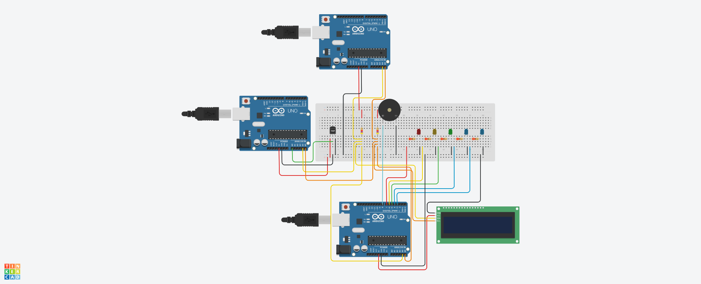
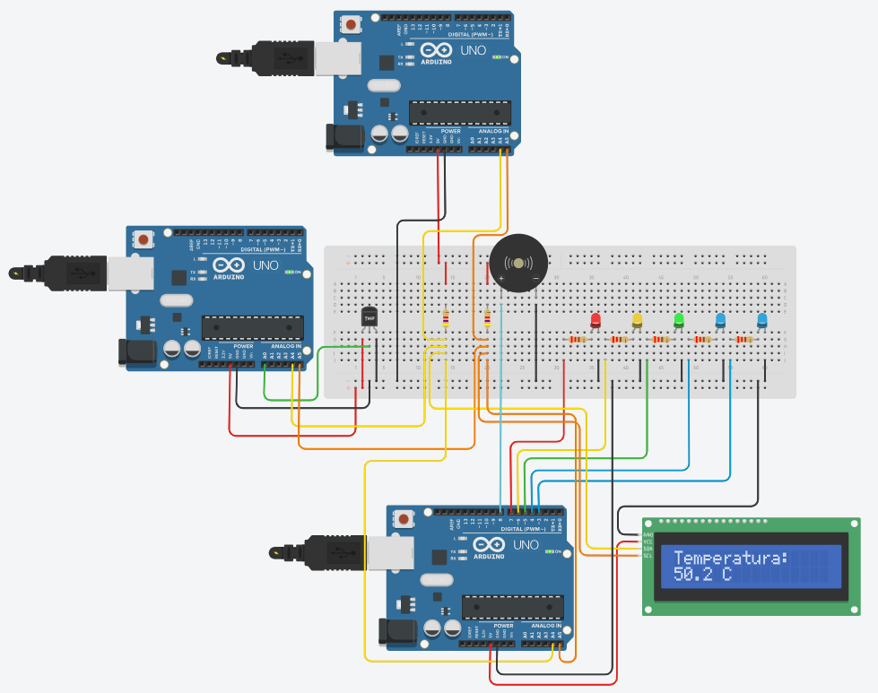

# Demostración: monitoreo de temperatura por I2C

Demostración de un **bus I2C con cuatro dispositivos**, simulado en Tinkercad: tres Arduino y una pantalla LCD comparten los mismos dos cables. El sistema mide la temperatura, la muestra en una pantalla y en una barra de LEDs, y **activa una alarma al llegar a 50 °C**.

**Circuito en Tinkercad:** [Demo: monitoreo de temperatura](https://www.tinkercad.com/things/kzwUfOrm15J-demo-monitoreotemperatura?sharecode=Z5V_KeXMRNdRYW73awoHJ0VUQL0b_aChEBYX-uUyoL8)

<!-- CAPTURA 1: circuito completo de la demo en Tinkercad, con el zumbador conectado al esclavo 2. -->


## Objetivo

Mostrar en funcionamiento los conceptos centrales de I2C:

- **Direccionamiento:** varios dispositivos en dos cables, cada uno con su dirección.
- **Lectura y escritura:** el maestro le pide datos a un dispositivo y se los envía a otro.
- **Confirmación con ACK:** el destinatario confirma cada byte que recibe.
- **Resistencias pull-up:** las líneas solo se tiran a 0; las resistencias las suben a 1.

## ¿Para qué sirve un sistema así?

Vigilar una temperatura y avisar cuando supera un límite es una tarea muy común en sistemas embebidos. Por ejemplo, en un **cuarto de servidores**, donde una falla del aire acondicionado sobrecalienta los equipos; en un **invernadero**, donde unos grados de más pueden arruinar una cosecha; en un **motor industrial**, cuyo calor avisa que algo está por fallar; o en un depósito de **baterías de litio**, donde el calor es un riesgo de incendio.

Todos estos sistemas necesitan lo mismo: alguien que **mida**, alguien que **coordine** y alguien que **avise**.

## Componentes

| Dispositivo | Dirección I2C | Función | Código |
|---|---|---|---|
| Arduino maestro | — | Coordina el bus: pide la temperatura y la reenvía | [`maestro/maestro.ino`](maestro/maestro.ino) |
| Arduino esclavo 1 | `0x08` | Lee el sensor de temperatura TMP36 (pin A0) | [`esclavo1_sensor/esclavo1_sensor.ino`](esclavo1_sensor/esclavo1_sensor.ino) |
| Arduino esclavo 2 | `0x09` | Muestra la temperatura en la LCD y en 5 LEDs (pines 3 a 7), y hace sonar la alarma (pin 8) | [`esclavo2_lcd_leds/esclavo2_lcd_leds.ino`](esclavo2_lcd_leds/esclavo2_lcd_leds.ino) |
| Pantalla LCD 16x2 con I2C | `0x20` | Muestra la temperatura | — |

**Conexiones del bus:** todos comparten SDA (pin A4) y SCL (pin A5), con dos resistencias pull-up de 4,7 kΩ hacia 5 V y tierra común. El esquemático está en [`circuito/esquematico.pdf`](circuito/esquematico.pdf).

**Alarma:** un zumbador piezoeléctrico conectado al pin 8 del esclavo 2 y a GND.

## Cómo funciona

1. **El esclavo 1 mide.** Cada segundo lee el TMP36 y convierte el voltaje a grados Celsius.
2. **El maestro pide el dato.** Cada segundo le solicita la temperatura al esclavo 1 con `Wire.requestFrom()`. El esclavo responde con 4 bytes: un número `float` desarmado en bytes.
3. **El maestro reenvía el dato.** Se lo envía al esclavo 2 con `Wire.beginTransmission()` y `Wire.write()`. El esclavo 2 confirma cada byte con un ACK; si nadie respondiera en esa dirección, `Wire.endTransmission()` devolvería un error.
4. **El esclavo 2 avisa.** Vuelve a armar el número, lo muestra en la pantalla y enciende los LEDs como un termómetro de barra:

| Temperatura | LEDs encendidos |
|---|---|
| Menos de 20 °C | 1 |
| 20 a 29,9 °C | 2 |
| 30 a 39,9 °C | 3 |
| 40 a 49,9 °C | 4 |
| 50 °C o más | 5, y suena la alarma |

<!-- CAPTURA 2: simulación con la temperatura por encima de 50 °C, los 5 LEDs encendidos y la LCD mostrando el valor. Si se ve el control deslizante del TMP36, mejor. -->


Cada transferencia por I2C toma menos de un milisegundo. La frecuencia de actualización, una vez por segundo, la define el programa, no el protocolo.

## Cómo correrla

1. Abrí el [circuito en Tinkercad](https://www.tinkercad.com/things/kzwUfOrm15J-demo-monitoreotemperatura?sharecode=Z5V_KeXMRNdRYW73awoHJ0VUQL0b_aChEBYX-uUyoL8) y presioná **Iniciar simulación**.
2. Abrí el **monitor serie del maestro** (botón **Código** → elegí el maestro en el desplegable → **Monitor en serie**). Cada segundo muestra:

```
[Master] Temperatura recibida: 22.30 °C
[Master] Dato enviado al Slave 2 OK
```

La primera línea indica que el esclavo 1 respondió; la segunda, que el esclavo 2 confirmó la recepción con ACK.

3. Hacé clic en el sensor TMP36 y subí la temperatura con el control deslizante. Al pasar los 50 °C, se encienden los 5 LEDs y suena la alarma; al bajarla, se apaga.

## Detalles del código

- **Callbacks cortos:** las funciones que atienden I2C (`Wire.onReceive` y `Wire.onRequest`) corren dentro de interrupciones, así que solo guardan el dato y levantan una bandera; la pantalla se actualiza en `loop()`.
- **Variables `volatile` y copias atómicas:** las variables compartidas con las interrupciones son `volatile`, y el `float` se copia con `noInterrupts()` / `interrupts()`, porque el procesador de 8 bits lo copia en varios pasos.
- **Alarma sin `delay()`:** el pitido se controla con `millis()`, así el esclavo 2 sigue atendiendo el bus I2C mientras suena.
- **Bus multi-maestro:** para escribir en la pantalla, el esclavo 2 también actúa como maestro del bus.

## Cambiar la temperatura de la alarma

La alarma se activa al encenderse el quinto LED, que depende de los umbrales del esclavo 2:

```cpp
const float UMBRALES[] = {20.0, 30.0, 40.0, 50.0};
```

El último valor es la temperatura de la alarma. Conviene ajustar los cuatro para que la barra quede proporcionada; por ejemplo, para 60 °C: `{30.0, 40.0, 50.0, 60.0}`.

## Problemas comunes

| Problema | Solución |
|---|---|
| El monitor del maestro no muestra nada | Revisá en el desplegable que estés viendo el monitor del **maestro** y que la simulación esté iniciada. |
| El maestro dice que el esclavo 1 no respondió | Revisá los cables de SDA (A4), SCL (A5) y GND del esclavo 1. |
| La pantalla no enciende | En las propiedades de la LCD, el tipo debe ser **PCF8574**; el código usa la dirección `0x20`. |
| La alarma suena entrecortada | Es una limitación de la simulación de Tinkercad cuando el circuito es pesado; en un circuito real suena limpia. |