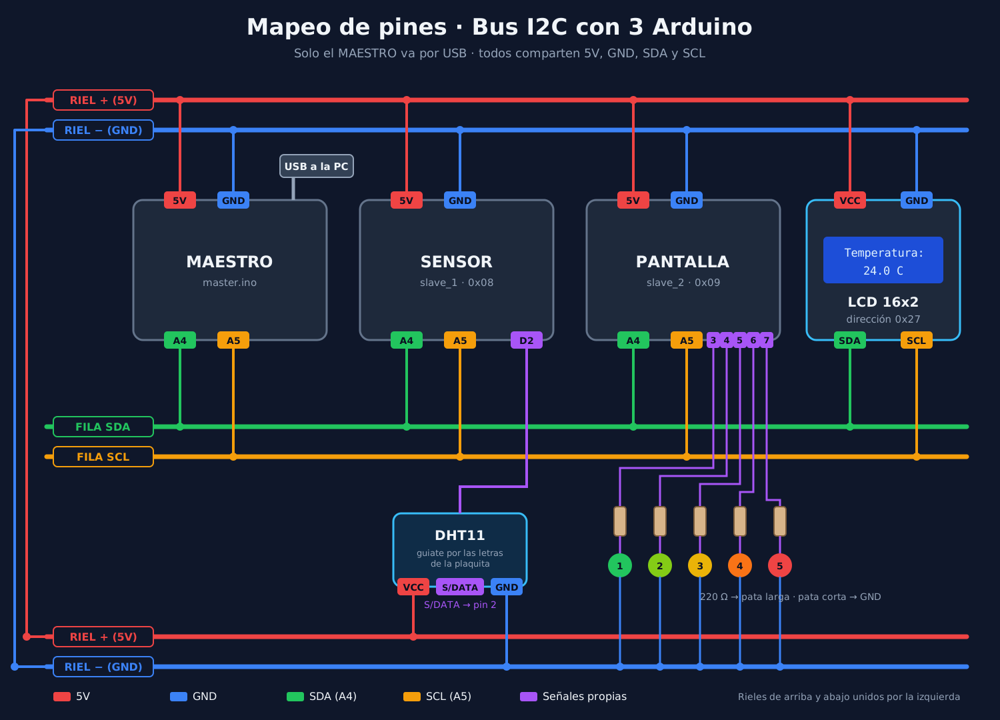
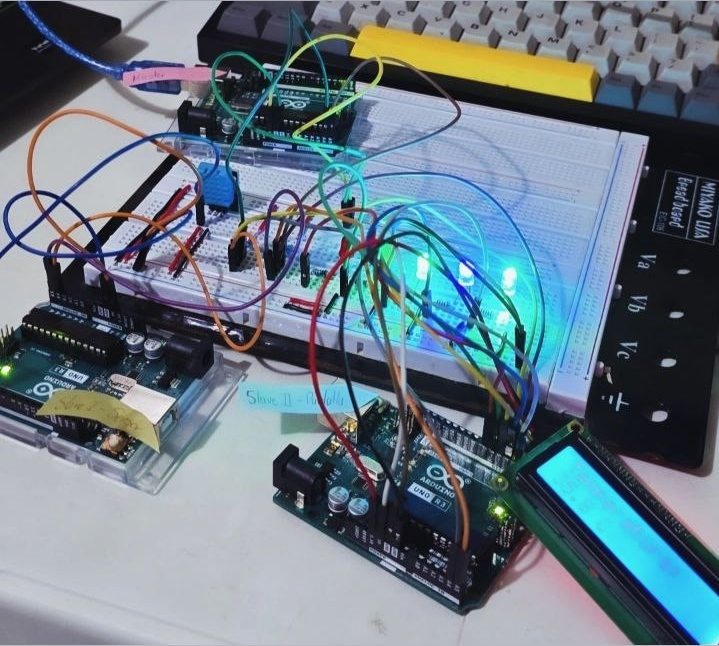

# Demostración: monitoreo de temperatura por I2C

Demostración en vivo de un **bus I2C con cuatro dispositivos**, armada en físico: tres Arduino y una pantalla LCD comparten los mismos dos cables. El sistema mide la temperatura con un sensor **DHT11** y la muestra en una pantalla y en una barra de 5 LEDs que se va llenando a medida que sube el calor.

<p align="center">
  
</p>

<!-- FOTO: el montaje real en la protoboard, con las tres placas, la LCD y el DHT11 a la vista. -->
<p align="center">
  
</p>

## Objetivo

Mostrar en funcionamiento los conceptos centrales de I2C:

- **Direccionamiento:** varios dispositivos en dos cables, cada uno con su dirección.
- **Lectura y escritura:** el maestro le pide datos a un dispositivo y se los envía a otro.
- **Confirmación con ACK:** el destinatario confirma cada byte que recibe.
- **Resistencias pull-up:** las líneas solo se tiran a 0; las resistencias las suben a 1.

## ¿Para qué sirve un sistema así?

Vigilar una temperatura es una tarea muy común en sistemas embebidos. Por ejemplo, en un **cuarto de servidores**, donde una falla del aire acondicionado sobrecalienta los equipos; en un **invernadero**, donde unos grados de más pueden arruinar una cosecha; o en un **motor industrial**, cuyo calor avisa que algo está por fallar.

Todos estos sistemas necesitan lo mismo: alguien que **mida**, alguien que **coordine** y alguien que **muestre** el resultado.

## Componentes

| Dispositivo | Dirección I2C | Función | Código |
|---|---|---|---|
| Arduino maestro | — | Coordina el bus: pide la temperatura y la reenvía | [`maestro/maestro.ino`](maestro/maestro.ino) |
| Arduino esclavo 1 | `0x08` | Lee el sensor DHT11 (pin D2) | [`esclavo1_sensor/esclavo1_sensor.ino`](esclavo1_sensor/esclavo1_sensor.ino) |
| Arduino esclavo 2 | `0x09` | Muestra la temperatura en la LCD y en 5 LEDs (pines 3 a 7) | [`esclavo2_lcd_leds/esclavo2_lcd_leds.ino`](esclavo2_lcd_leds/esclavo2_lcd_leds.ino) |
| Pantalla LCD 16x2 con I2C | `0x27` | Muestra la temperatura | — |

**Material:** 3 Arduino Uno, LCD 16x2 con módulo I2C (PCF8574), sensor DHT11 (módulo de 3 pines), 5 LEDs con resistencias de 220 Ω, protoboard, cables de puente y un cable USB.

**Conexiones del bus:** todos comparten SDA (pin A4) y SCL (pin A5). Las resistencias pull-up ya vienen en el módulo I2C de la pantalla, así que no hace falta agregarlas. **Los GND de las tres placas, la LCD y el sensor van unidos:** sin tierra común, las señales no tienen una referencia y el bus no funciona.

**Alimentación:** solo el maestro va conectado por USB. Su 5 V y su GND alimentan los rieles de la protoboard, y de ahí toman corriente los otros dos Arduino (por su pin 5V), la pantalla, el sensor y los LEDs. Todo junto consume unos 250 mA, menos de lo que da un puerto USB.

**Sensor:** el DHT11 se conecta a 5 V, GND y su pin de datos (marcado **S** o **DATA** en la plaquita) al pin D2 del esclavo 1. El orden de los pines cambia según el fabricante: guiate por las letras impresas.

## Cómo funciona

1. **El esclavo 1 mide.** Cada 5 segundos lee la temperatura del DHT11.
2. **El maestro pide el dato.** Cada 5 segundos le solicita la temperatura al esclavo 1 con `Wire.requestFrom()`. El esclavo responde con 4 bytes: un número `float` desarmado en bytes.
3. **El maestro reenvía el dato.** Se lo envía al esclavo 2 con `Wire.beginTransmission()` y `Wire.write()`. El esclavo 2 confirma cada byte con un ACK; si nadie respondiera en esa dirección, `Wire.endTransmission()` devolvería un error.
4. **El esclavo 2 muestra.** Vuelve a armar el número, lo muestra en la pantalla y enciende los LEDs como un termómetro de barra: uno más cada 4 °C.

<p align="center">
  
</p>

| Temperatura | LEDs encendidos |
|---|---|
| Menos de 28 °C | 1 (la temperatura del aula) |
| 28 a 31,9 °C | 2 |
| 32 a 35,9 °C | 3 |
| 36 a 39,9 °C | 4 |
| 40 °C o más | 5 (barra llena) |

Cada transferencia por I2C toma menos de un milisegundo. La frecuencia de actualización, una vez cada 5 segundos, la define el programa, no el protocolo.

## Cómo correrla

1. Instalá en el Arduino IDE las bibliotecas **DHT sensor library** (Adafruit, aceptando también *Adafruit Unified Sensor*) y **LiquidCrystal I2C** (Frank de Brabander), desde el Gestor de bibliotecas.
2. Confirmá la dirección de tu pantalla con un **I2C Scanner**: cada fabricante usa una distinta (casi siempre `0x27` o `0x3F`). Si no es `0x27`, cambiala en el esclavo 2.
3. Cargá cada código en su placa, de una en una y antes de armar el bus: el maestro, el esclavo 1 y el esclavo 2. El código queda guardado en la placa aunque la desconectés.
4. Armá el circuito, dejá el maestro conectado por USB y abrí su **monitor serie** a 9600 baudios. Cada 5 segundos muestra:

```
[Master] Temperatura recibida: 25.00 °C
[Master] Dato enviado al Slave 2 OK
```

La primera línea indica que el esclavo 1 respondió; la segunda, que el esclavo 2 confirmó la recepción con ACK.

5. Calentá el sensor con una secadora en aire tibio, a unos 20-30 cm y en ráfagas cortas, y mirá cómo la pantalla se actualiza y la barra de LEDs se llena. Al enfriarse, los LEDs se van apagando. Apuntá solo al sensor: el aire caliente puede ablandar la protoboard y los cables.

**Para mostrar el ACK en vivo:** desconectá el cable A4 del esclavo 1 mientras corre. El monitor del maestro muestra `Error: Slave 1 no respondió`; al reconectarlo, se recupera solo.

> **Versión simulada:** el mismo circuito está en Tinkercad, con un TMP36 en lugar del DHT11, para quien quiera reproducirlo sin hardware: [Demo: monitoreo de temperatura](https://www.tinkercad.com/things/kzwUfOrm15J-demo-monitoreotemperatura?sharecode=Z5V_KeXMRNdRYW73awoHJ0VUQL0b_aChEBYX-uUyoL8).

## Detalles del código

- **Datos como bytes:** I2C transporta bytes, no números con decimales. Por eso el `float` de la temperatura se desarma en 4 bytes con `memcpy()` antes de enviarlo y se vuelve a armar al recibirlo.
- **Callbacks cortos:** las funciones que atienden I2C (`Wire.onReceive` y `Wire.onRequest`) corren dentro de interrupciones, así que solo guardan el dato y levantan una bandera; la pantalla y los LEDs se actualizan en `loop()`.
- **Sin `delay()`:** los tiempos se controlan con `millis()`, así cada Arduino sigue atendiendo el bus mientras espera.
- **Bus multi-maestro:** para escribir en la pantalla, el esclavo 2 también actúa como maestro del bus.

## Cambiar los umbrales

Los LEDs que se encienden dependen de los umbrales del esclavo 2:

```cpp
const float UMBRALES[] = {28.0, 32.0, 36.0, 40.0};
```

Cada valor es la temperatura a la que se enciende un LED más. Están separados por 4 °C para que la barra se llene con una secadora a distancia, sin pasar los 50 °C, el máximo que mide el DHT11. Lo ideal es que, a la temperatura del aula, solo esté encendido el primer LED: si el aula está más caliente o más fría, poné el primer umbral unos 3 °C por encima de lo que marca la pantalla y corré los otros tres manteniendo los saltos de 4 °C.

## Problemas comunes

| Problema | Solución |
|---|---|
| El monitor del maestro no muestra nada | Revisá que el monitor esté abierto en el puerto del **maestro** y a 9600 baudios. |
| El maestro dice que el esclavo 1 no respondió | Revisá los cables de SDA (A4), SCL (A5) y, sobre todo, el **GND común**. |
| La pantalla tiene luz pero no muestra texto, o muestra cuadros | Ajustá el contraste con el potenciómetro azul del módulo I2C, girándolo despacio. Si sigue sin texto, corré un I2C Scanner: la dirección puede ser `0x3F` en lugar de `0x27`. |
| La temperatura no cambia nunca | El esclavo 1 no logra leer el DHT11 y conserva el último valor; su propio monitor muestra `Error leyendo el DHT11`. Revisá que la pata **S/DATA** vaya a D2 y la alimentación del sensor. |
| La temperatura sube muy despacio | El DHT11 es lento: tarda unos segundos en reaccionar a un cambio de calor. |
| Los LEDs no encienden, pero la pantalla sí | En muchas protoboards el riel de GND está cortado a la mitad: uní las dos mitades con un cable. Revisá también que la pata larga de cada LED vaya hacia la resistencia. |
| Error al compilar: `DHT.h` o `LiquidCrystal_I2C.h`: *No such file* | Falta instalar la biblioteca (paso 1 de "Cómo correrla"). |
| En Linux no aparece el puerto del Arduino | Corré `sudo usermod -aG dialout $USER`, cerrá sesión y volvé a entrar. |
