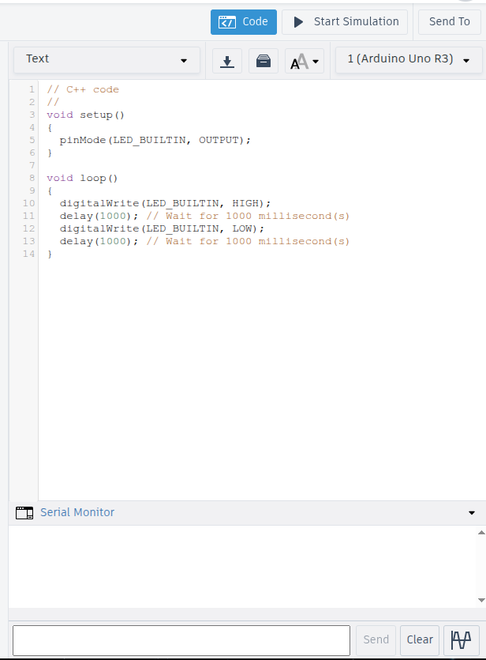
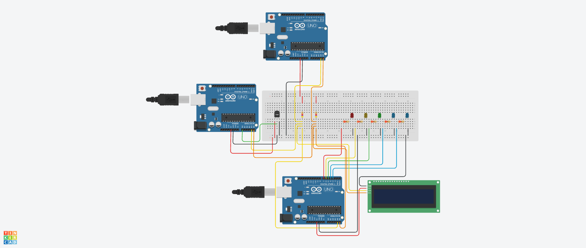
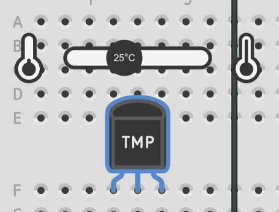
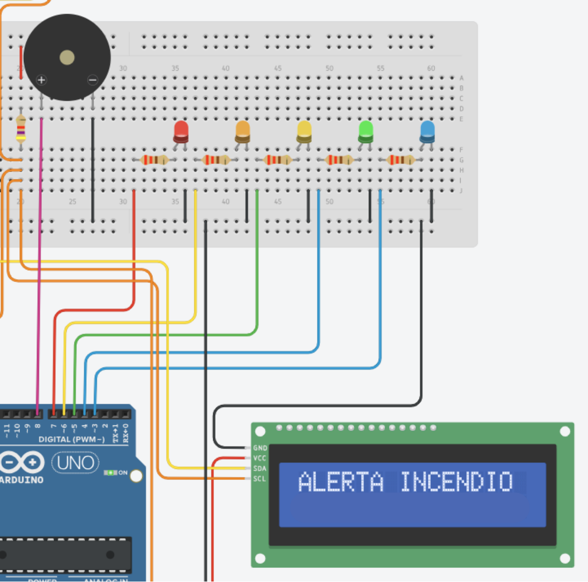
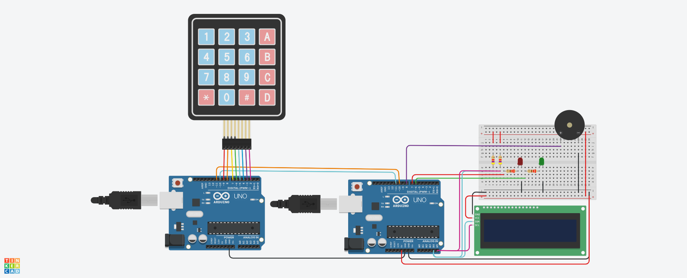
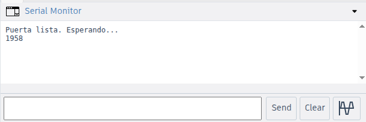
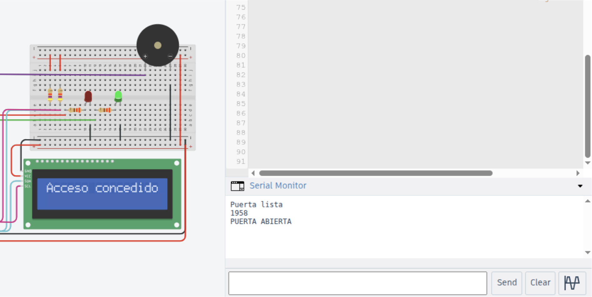

# Guía del tutorial: Laboratorio cerrado

**Mini-Taller de Protocolos de Comunicación** · EL5841 Taller de Sistemas Embebidos
**Diseñado por:** Luis Diego García Rojas · **Duración estimada:** 45 a 60 minutos

## 1. Introducción y objetivos del tutorial

Anoche, un corte de luz reinició el sistema de control de acceso del laboratorio de sistemas embebidos. Al volver la energía, el sistema entró en **modo seguro**: la puerta quedó bloqueada y la contraseña del servidor que lo administra se dividió en **dos fragmentos**. Esta técnica se llama *control dual* y se usa en sistemas críticos para que una sola persona no pueda tomar el control.

Cada fragmento lo guarda un dispositivo que habla un protocolo distinto. Para abrir el laboratorio, vas a tener que comunicarte con cada uno en su propio idioma:

| Misión | Dispositivo | Protocolo | Resultado |
|---|---|---|---|
| 1 | Sensor de temperatura | I2C | Fragmento 1 |
| 2 | Cerradura con teclado | UART | Fragmento 2 |
| 3 | Servidor del laboratorio | SSH | Puerta abierta |

### Objetivos de aprendizaje

1. Observar un bus **I2C** con varios dispositivos: direccionamiento, confirmación (ACK) y resistencias pull-up.
2. Programar una comunicación **UART** entre dos microcontroladores: baud rate, cables cruzados y fin de mensaje.
3. Entender cómo viajan los datos como **bytes** y cómo se representan las letras en **ASCII**.
4. Construir un servidor **SSH** en un contenedor de Docker y usarlo como lo haría un técnico: verificar la huella del servidor, ejecutar comandos a distancia y copiar archivos con `scp`.
5. Reconocer buenas prácticas de seguridad: por qué Linux guarda hashes y no contraseñas, y por qué no se ignora una huella que cambia.

## 2. Requerimientos de software y hardware

| Componente / Recurso | Especificación | Tipo |
|---|---|---|
| Computadora | Cualquier laptop con navegador web | Hardware |
| Tinkercad | Cuenta gratuita en tinkercad.com (misiones 1 y 2) | Software |
| Sistema operativo | Linux; Ubuntu 22.04 o superior recomendado (misión 3) | Software |
| Docker | Docker Engine con Compose v2 (misión 3) | Software |
| Cliente SSH | `ssh` y `scp`, incluidos en Linux y macOS | Software |
| Editor de texto | `nano`, VS Code o cualquier otro | Software |

No se necesita ningún hardware físico: los circuitos se simulan en Tinkercad y el servidor corre dentro de tu computadora con Docker.

## 3. Instrucciones paso a paso

### Cómo usar Tinkercad (misiones 1 y 2)

En las misiones 1 y 2 trabajás sobre un circuito ya armado:

1. Abrí el enlace del circuito y hacé clic en **Copiar y modificar**, para trabajar sobre tu propia copia.
2. Para ver o cambiar el código, hacé clic en **Código**, arriba a la derecha. En el **desplegable** de arriba del panel elegís qué Arduino querés ver.
3. Si el código está en *Bloques*, cambialo a **Texto**.
4. Abajo del panel está el **Monitor en serie**: ahí aparece todo lo que el Arduino imprime con `Serial.print`. Muestra el monitor del Arduino elegido en el desplegable.
5. **Iniciar simulación** arranca el circuito. Detené la simulación antes de cambiar un código: Tinkercad no aplica cambios mientras corre.

<!-- IMAGEN: captura del panel de código de Tinkercad, señalando el botón Código, el desplegable de placas, el modo Texto y el botón Monitor en serie. -->


---

## Misión 1: El sensor de temperatura (I2C)

**Enlace al circuito:** *(agregar enlace de Tinkercad)*

Este es el sistema de monitoreo del laboratorio, el mismo de la demostración. Tiene **cuatro dispositivos en un mismo bus I2C**:

| Dispositivo | Dirección I2C | Función |
|---|---|---|
| Arduino maestro | — | Coordina el bus |
| Arduino esclavo 1 | `0x08` | Lee el sensor de temperatura TMP36 |
| Arduino esclavo 2 | `0x09` | Maneja la pantalla y 5 LEDs |
| Pantalla LCD 16x2 | `0x20` | Muestra la temperatura |



Todos comparten solo dos líneas: **SDA** (datos, pin A4) y **SCL** (reloj, pin A5). Las dos resistencias de 4,7 kΩ son las **pull-ups**: en I2C los dispositivos solo pueden tirar las líneas a 0, y las resistencias las suben a 1 cuando nadie las usa.

**Cómo funciona.** Cada 5 segundos, el maestro le **pide** la temperatura al esclavo 1, que responde con 4 bytes. Después, el maestro le **envía** esos bytes al esclavo 2, que los muestra en la pantalla y enciende los LEDs como un termómetro de barra. Cada mensaje empieza con la **dirección** del destinatario, y el destinatario confirma cada byte con un **ACK**.

### Paso 1.1: Iniciá la simulación

Presioná **Iniciar simulación** y abrí el **monitor serie del maestro**. Cada 5 segundos vas a ver:

```
[Master] Temperatura recibida: 22.30 °C
[Master] Dato enviado al Slave 2 OK
```

La primera línea muestra que el esclavo 1 respondió; la segunda, que el esclavo 2 confirmó con ACK.

### Paso 1.2: Subí la temperatura

Hacé clic sobre el sensor **TMP36**: aparece un control deslizante. Subí la temperatura de a poco y mirá cómo se llena la barra de LEDs:

| Temperatura | LEDs encendidos |
|---|---|
| Menos de 15 °C | 1 |
| 15 a 19,9 °C | 2 |
| 20 a 24,9 °C | 3 |
| 25 a 29,9 °C | 4 |
| 30 °C o más | 5 |

<!-- IMAGEN: captura con la simulación corriendo y el control deslizante del TMP36 visible. -->


### Paso 1.3: Obtené el fragmento 1

El sistema tiene una **regla de emergencia**: ante un posible incendio, libera la mitad de la contraseña para que nadie quede atrapado. Llevá la temperatura a **30 °C o más** y esperá hasta 10 segundos (el maestro lee cada 5).

Al encenderse el quinto LED, la pantalla muestra el **fragmento 1**. Anotalo.

<!-- IMAGEN: captura de la pantalla LCD mostrando "Fragmento 1:" con los 5 LEDs encendidos (se puede tapar o difuminar la palabra para no revelarla). -->


**Un detalle del código.** En el esclavo 2, el fragmento no está escrito como texto sino como **códigos ASCII**: `0x74, 0x65, 0x72...`. Así viajan las letras por cualquier protocolo: como bytes. Al mostrarlo, `(char)` convierte cada número en su letra.

---

## Misión 2: La cerradura (UART)

**Enlace al circuito:** *(agregar enlace de Tinkercad)*

La cerradura tiene dos Arduino: el **Lector**, con un teclado, y la **Puerta**, con LEDs, un zumbador y una pantalla. El Lector le envía por **UART** el código tecleado, y la Puerta decide si abre. El circuito ya está armado; tu trabajo es **programarlo en 5 etapas**. En cada una pegás el código, lo probás y entendés qué hace.

<!-- IMAGEN: captura del circuito completo de la cerradura (Lector con teclado, Puerta con LEDs, zumbador y LCD), idealmente con los cables de UART en colores distintos. -->


### Conexiones

**Lector**

| Desde | Hacia |
|---|---|
| Teclado Row 1 a Row 4 | ~9, 8, 7, ~6 |
| Teclado Column 1 a Column 4 | ~5, 4, ~3, 2 |
| ~11 (TX) | ~10 de la Puerta |
| ~10 (RX) | ~11 de la Puerta |
| GND | GND de la Puerta |

**Puerta**

| Componente | Pin |
|---|---|
| LED verde (con 220 Ω): puerta abierta | ~6 |
| LED rojo (con 220 Ω): puerta cerrada | 7 |
| Zumbador piezo | 8 |
| LCD 16x2 (I2C): SDA / SCL | A4 / A5 |

Dos detalles importantes del circuito:
- **Los cables de UART van cruzados:** el pin que transmite (TX) de un Arduino va al que recibe (RX) del otro.
- **Los dos Arduino comparten GND:** un voltaje solo significa 0 o 1 respecto a una tierra común.

### Etapa 1 — Lector: leer el teclado

Elegí el **Lector** en el desplegable y pegá este código (también está en `2-cerradura-uart/etapas/etapa1_lector.ino`):

```cpp
// ETAPA 1 - LECTOR: leer el teclado
#include <Keypad.h>

// El teclado es una matriz: 4 filas y 4 columnas
const byte FILAS = 4, COLS = 4;
char teclas[FILAS][COLS] = {
  {'1','2','3','A'},
  {'4','5','6','B'},
  {'7','8','9','C'},
  {'*','0','#','D'}
};
byte pinesFilas[FILAS] = {9, 8, 7, 6};   // Row 1..4
byte pinesCols[COLS]   = {5, 4, 3, 2};   // Column 1..4
Keypad teclado = Keypad(makeKeymap(teclas), pinesFilas, pinesCols, FILAS, COLS);

void setup() {
  Serial.begin(9600);
  Serial.println(F("Lector listo. Presiona teclas."));
}

void loop() {
  char t = teclado.getKey();     // Devuelve la tecla, o 0 si no hay ninguna
  if (t) {
    Serial.print(F("Tecla: "));
    Serial.println(t);
  }
}
```

**Qué hace.** El teclado no tiene un cable por tecla: tiene 8, porque es una **matriz** de 4 filas por 4 columnas. Cada tecla, al presionarse, une una fila con una columna. La librería `Keypad` revisa una fila a la vez y detecta qué columna responde; con la tabla `teclas`, traduce esa posición en un carácter.

**Resultado esperado.** Iniciá la simulación, abrí el monitor del Lector y hacé clic en algunas teclas:

```
Lector listo. Presiona teclas.
Tecla: 1
Tecla: 9
```

### Etapa 2 — Lector: enviar el código por UART

Reemplazá el código del **Lector** (`2-cerradura-uart/etapas/etapa2_lector.ino`):

```cpp
// ETAPA 2 - LECTOR: armar el codigo y enviarlo por UART
#include <Keypad.h>
#include <SoftwareSerial.h>

const long BAUD_UART = 1200;     // Debe ser igual en el Lector y en la Puerta

SoftwareSerial uart(10, 11);     // RX = ~10, TX = ~11

const byte FILAS = 4, COLS = 4;
char teclas[FILAS][COLS] = {
  {'1','2','3','A'},
  {'4','5','6','B'},
  {'7','8','9','C'},
  {'*','0','#','D'}
};
byte pinesFilas[FILAS] = {9, 8, 7, 6};   // Row 1..4
byte pinesCols[COLS]   = {5, 4, 3, 2};   // Column 1..4
Keypad teclado = Keypad(makeKeymap(teclas), pinesFilas, pinesCols, FILAS, COLS);

char codigo[9];                  // Hasta 8 digitos + el fin de texto
byte largo = 0;

void setup() {
  Serial.begin(9600);
  uart.begin(BAUD_UART);
  Serial.println(F("Lector listo. Escribi el codigo y presiona #"));
}

void loop() {
  char t = teclado.getKey();
  if (!t) return;

  if (t == '#') {                  // Enviar: el codigo y un '\n' que marca el final
    codigo[largo] = '\0';
    uart.print(codigo);
    uart.print('\n');
    Serial.print(F(" -> enviado: "));
    Serial.println(codigo);
    largo = 0;
  } else if (t == '*') {           // Borrar
    largo = 0;
    Serial.println(F(" (borrado)"));
  } else if (largo < 8) {          // Guardar la tecla
    codigo[largo++] = t;
    Serial.print('*');
  }
}
```

**Qué hace.**
- `SoftwareSerial uart(10, 11)` crea un UART en los pines ~10 y ~11. El Arduino Uno tiene un solo UART de hardware, en los pines 0 y 1, y lo ocupa el monitor serie; `SoftwareSerial` imita otro por software.
- `BAUD_UART = 1200` es la velocidad: 1200 bits por segundo. UART **no tiene reloj compartido**, así que los dos lados deben usar la misma velocidad: cada uno mide la duración de cada bit con su propio reloj.
- Al presionar `#`, envía el código **seguido de un `'\n'`**. UART solo transporta bytes sueltos y no sabe dónde termina un mensaje; esa regla la definimos nosotros. Es un pequeño protocolo de aplicación encima de un protocolo de enlace, igual que en el modelo OSI.

**Resultado esperado.** Tecleá `1958` y `#`:

```
**** -> enviado: 1958
```

Todavía no pasa nada más: la Puerta no tiene programa.

### Etapa 3 — Puerta: recibir lo que llega

Elegí la **Puerta** en el desplegable y pegá (`2-cerradura-uart/etapas/etapa3_puerta.ino`):

```cpp
// ETAPA 3 - PUERTA: recibir por UART y mostrar lo que llega
#include <SoftwareSerial.h>

const long BAUD_UART = 1200;     // Igual que en el Lector

SoftwareSerial uart(10, 11);     // RX = ~10, TX = ~11

void setup() {
  Serial.begin(9600);
  uart.begin(BAUD_UART);
  Serial.println(F("Puerta lista. Esperando..."));
}

void loop() {
  if (uart.available()) {        // Llego al menos un byte?
    char c = uart.read();        // Lo tomamos
    Serial.write(c);             // Y lo mostramos tal cual
  }
}
```

**Qué hace.** Configura el mismo UART a la misma velocidad y muestra cada byte que llega. `uart.available()` indica si llegó algo y `uart.read()` lo toma.

**Resultado esperado.** Iniciá la simulación, abrí el monitor de la **Puerta** y tecleá `1958#` en el teclado. El mensaje viajó de una placa a la otra:

```
Puerta lista. Esperando...
1958
```

<!-- IMAGEN: captura del monitor serie de la Puerta mostrando "1958" recibido. -->


### Etapa 4 — Puerta: verificar el código

Reemplazá el código de la **Puerta** (`2-cerradura-uart/etapas/etapa4_puerta.ino`):

```cpp
// ETAPA 4 - PUERTA: armar el mensaje, verificar el codigo y usar los LEDs
#include <SoftwareSerial.h>

const long BAUD_UART = 1200;
const char CODIGO_CORRECTO[] = "1958";

const byte PIN_LED_VERDE = 6;    // Puerta abierta
const byte PIN_LED_ROJO  = 7;    // Puerta cerrada

SoftwareSerial uart(10, 11);

char recibido[17];               // Aqui se arma el mensaje
byte largo = 0;

void setup() {
  Serial.begin(9600);
  uart.begin(BAUD_UART);
  pinMode(PIN_LED_VERDE, OUTPUT);
  pinMode(PIN_LED_ROJO, OUTPUT);
  digitalWrite(PIN_LED_ROJO, HIGH);   // Arranca cerrada
  Serial.println(F("Puerta lista. Esperando codigo..."));
}

void loop() {
  if (!uart.available()) return;

  char c = uart.read();
  Serial.write(c);

  if (c == '\r') return;           // Se ignora
  if (c == '\n') {                 // Fin del mensaje: verificamos
    recibido[largo] = '\0';
    verificar();
    largo = 0;
  } else if (largo < 16) {         // Seguimos armando el mensaje
    recibido[largo++] = c;
  }
}

void verificar() {
  if (strcmp(recibido, CODIGO_CORRECTO) == 0) {
    digitalWrite(PIN_LED_ROJO, LOW);
    digitalWrite(PIN_LED_VERDE, HIGH);
    Serial.println(F("PUERTA ABIERTA"));
  } else {
    Serial.println(F("Codigo invalido"));
  }
}
```

**Qué hace.** La Puerta **arma el mensaje** byte por byte en `recibido` hasta que llega el `'\n'`. Ahí sabe que terminó y lo compara con el código correcto usando `strcmp()`, que devuelve 0 cuando dos textos son iguales. Si coincide, apaga el LED rojo y enciende el verde.

**Resultado esperado.** Con `1234#`, el monitor dice `Codigo invalido`. Con `1958#`, dice `PUERTA ABIERTA` y se enciende el LED verde.

### Etapa 5 — Puerta: la versión completa

Reemplazá por última vez el código de la **Puerta** (`2-cerradura-uart/etapas/etapa5_puerta.ino`):

```cpp
// ETAPA 5 - PUERTA: version completa con zumbador y pantalla
#include <SoftwareSerial.h>
#include <Wire.h>
#include <LiquidCrystal_I2C.h>

const long BAUD_UART = 1200;
const char CODIGO_CORRECTO[] = "1958";

// El fragmento 2 guardado como codigos ASCII (cada byte es una letra)
const byte FRAGMENTO_2[] = {0x63, 0x65, 0x72, 0x72, 0x6F, 0x6A, 0x6F};

const byte PIN_LED_VERDE = 6;    // Puerta abierta
const byte PIN_LED_ROJO  = 7;    // Puerta cerrada
const byte PIN_BUZZER    = 8;

SoftwareSerial uart(10, 11);          // RX = ~10, TX = ~11
LiquidCrystal_I2C lcd(0x20, 16, 2);   // SDA = A4, SCL = A5

char recibido[17];
byte largo = 0;
unsigned long ultimo = 0;        // Momento del ultimo byte recibido

void setup() {
  Serial.begin(9600);
  uart.begin(BAUD_UART);
  pinMode(PIN_LED_VERDE, OUTPUT);
  pinMode(PIN_LED_ROJO, OUTPUT);
  pinMode(PIN_BUZZER, OUTPUT);
  lcd.init();
  lcd.backlight();
  cerrar();
  Serial.println(F("Puerta lista"));
}

void loop() {
  if (!uart.available()) return;

  char c = uart.read();
  Serial.write(c);

  if (millis() - ultimo > 1000) largo = 0;   // Resto de un mensaje viejo: se descarta
  ultimo = millis();

  if (c == '\r') return;
  if (c == '\n') {
    recibido[largo] = '\0';
    verificar();
    largo = 0;
  } else if (largo < 16) {
    recibido[largo++] = c;
  } else {
    largo = 0;
  }
}

void verificar() {
  if (strcmp(recibido, CODIGO_CORRECTO) == 0) {
    abrir();
  } else {
    mostrar("Codigo invalido", "");
    tone(PIN_BUZZER, 200, 300);
    delay(1000);
    cerrar();
  }
}

void abrir() {
  digitalWrite(PIN_LED_ROJO, LOW);
  digitalWrite(PIN_LED_VERDE, HIGH);
  lcd.clear();
  lcd.setCursor(0, 0); lcd.print("Acceso concedido");
  lcd.setCursor(0, 1); lcd.print("Frag 2: ");
  for (byte i = 0; i < sizeof(FRAGMENTO_2); i++) {
    lcd.print((char)FRAGMENTO_2[i]);         // Cada codigo ASCII se muestra como letra
  }
  tone(PIN_BUZZER, 784, 300);
  Serial.println(F("PUERTA ABIERTA"));
}

void cerrar() {
  digitalWrite(PIN_LED_VERDE, LOW);
  digitalWrite(PIN_LED_ROJO, HIGH);
  mostrar("Puerta cerrada", "Ingrese codigo");
}

void mostrar(const char* linea1, const char* linea2) {
  lcd.clear();
  lcd.setCursor(0, 0); lcd.print(linea1);
  lcd.setCursor(0, 1); lcd.print(linea2);
}
```

**Qué agrega.**
- **La pantalla LCD por I2C**, en A4 y A5. En esta placa conviven dos protocolos: UART para hablar con el Lector e I2C para hablar con la pantalla.
- **El zumbador**, con `tone()`: un tono grave si el código es inválido y uno agudo al abrir.
- **El fragmento 2**, guardado como códigos ASCII, igual que en la misión 1.
- Si queda un mensaje a medias por más de un segundo, se descarta para que no contamine el siguiente.

**Resultado esperado.** Tecleá `1958#`. Se apaga el LED rojo, se enciende el verde, suena el zumbador y la pantalla muestra **Acceso concedido** y el **fragmento 2**. Anotalo.

<!-- IMAGEN: captura con la puerta abierta: LED verde encendido y LCD mostrando "Acceso concedido" y el fragmento 2 (se puede difuminar). -->


---

## Misión 3: El servidor del laboratorio (SSH)

Con los dos fragmentos tenés la contraseña del **servidor del laboratorio**. Pero primero hay que construirlo: vas a crear, archivo por archivo, una máquina Linux con un servidor SSH que Docker corre dentro de tu computadora. Las conexiones son SSH reales, con cifrado y verificación de identidad.

En los bloques de comandos, `tu-pc$` indica que el comando se ejecuta en tu computadora y `tecnico@servidor-lab:~$`, dentro del servidor. No copiés esos prefijos.

### Paso 3.1: Preparar Docker

Si todavía no lo hiciste (ver los requisitos):

```bash
tu-pc$ sudo apt update
tu-pc$ sudo apt install -y docker.io docker-compose-v2
tu-pc$ sudo usermod -aG docker $USER
```

Cerrá sesión y volvé a entrar. **Docker** crea **contenedores**: máquinas Linux pequeñas y aisladas que corren dentro de tu computadora.

### Paso 3.2: Crear la estructura

```bash
tu-pc$ mkdir -p servidor-lab/servidor
tu-pc$ cd servidor-lab
```

Al terminar, vas a tener:

```
servidor-lab/
├── docker-compose.yml
└── servidor/
    ├── Dockerfile
    ├── sshd_lab.conf
    ├── setup.sh
    └── puerta
```

Creá cada archivo con tu editor (por ejemplo, `nano servidor/Dockerfile`), pegá el contenido y guardá. Los mismos archivos están en `3-servidor-ssh/` como referencia.

### Paso 3.3: `docker-compose.yml`

```yaml
# El servidor del laboratorio: una maquina Linux con SSH
# que Docker crea dentro de tu computadora.
services:
  servidor:
    build: ./servidor          # Se construye con el Dockerfile de esa carpeta
    hostname: servidor-lab     # Nombre de la maquina
    ports:
      - "127.0.0.1:2222:22"    # Tu puerto 2222 -> puerto 22 (SSH) del servidor
```

**Qué hace.** Le indica a Docker qué máquina crear y cómo conectarla. Con `ports`, lo que entra al puerto **2222** de tu computadora se envía al puerto **22** del servidor, el puerto estándar de SSH. `127.0.0.1` hace que solo tu computadora pueda conectarse.

### Paso 3.4: `servidor/Dockerfile`

```dockerfile
# Partimos de un Ubuntu minimo
FROM ubuntu:24.04

# Instalamos el servidor SSH. Al instalarlo se generan las
# llaves de host: la identidad (y la huella) del servidor.
RUN apt-get update \
 && DEBIAN_FRONTEND=noninteractive apt-get install -y --no-install-recommends openssh-server \
 && rm -rf /var/lib/apt/lists/* \
 && mkdir -p /run/sshd \
 && sed -i 's/^session.*pam_motd.so/#&/' /etc/pam.d/sshd

# Copiamos nuestros archivos al servidor
COPY sshd_lab.conf /etc/ssh/sshd_config.d/lab.conf
COPY puerta /usr/local/bin/puerta
COPY setup.sh /opt/lab/setup.sh

# Preparamos el laboratorio
RUN chmod 755 /usr/local/bin/puerta && bash /opt/lab/setup.sh

# Al arrancar, el servidor SSH queda escuchando
EXPOSE 22
CMD ["/usr/sbin/sshd", "-D", "-e"]
```

**Qué hace.** Es la receta de la máquina:
- `FROM` parte de un Ubuntu mínimo.
- `RUN apt-get install openssh-server` instala el servidor SSH. Al instalarse, genera las **llaves de host**: la identidad del servidor, de donde sale su **huella**.
- `COPY` copia los demás archivos dentro de la máquina.
- `CMD` deja el servidor SSH (`sshd`) esperando conexiones.

### Paso 3.5: `servidor/sshd_lab.conf`

```
# Configuracion del servidor SSH

# Nadie entra directamente como administrador
PermitRootLogin no

# Se permite entrar con contrasena
PasswordAuthentication yes

# Sin mensajes estandar al entrar
PrintMotd no
PrintLastLog no
```

**Qué hace.** Configura el servidor SSH. `PermitRootLogin no` impide entrar directamente como administrador, una de las primeras medidas de seguridad en cualquier servidor real.

### Paso 3.6: `servidor/setup.sh`

```bash
#!/usr/bin/env bash
# Prepara el laboratorio dentro del servidor.
set -e

# 1. El usuario tecnico. Su contrasena no esta escrita aqui:
#    solo guardamos su HASH, igual que Linux en /etc/shadow.
useradd -m -s /bin/bash tecnico
echo 'tecnico:$6$Lab5841sal$vuDXQIQbTc9q2DQ3K62XTs/yMkAXf4NCdiY1oWosm2eYMEXoYCPcC0QU2Nftt0MBp2PZqkfwp4nwu22fedtlP1' | chpasswd -e

# 2. Un codigo de finalizacion al azar, distinto en cada computadora
mkdir -p /opt/lab
echo "LAB-$(tr -dc 'A-Z0-9' < /dev/urandom | head -c 6 || true)" > /opt/lab/codigo
chmod 644 /opt/lab/codigo

# 3. Los registros de lo que paso anoche
mkdir -p /var/log/laboratorio
cat > /var/log/laboratorio/acceso.log <<'LOG'
2026-10-02 18:30:02  cerradura  Acceso concedido (tarjeta 4411)
2026-10-02 19:05:44  cerradura  Puerta cerrada
2026-10-02 22:41:07  energia    CORTE DE ELECTRICIDAD
2026-10-02 22:47:52  energia    Energia restablecida. Reinicio del sistema
2026-10-02 22:47:55  sistema    Modo seguro activado. Puerta BLOQUEADA
2026-10-02 22:47:56  sistema    Contrasena del servidor dividida en dos fragmentos
2026-10-02 22:47:57  sensor     Fragmento 1 resguardado en el sensor de temperatura (I2C)
2026-10-02 22:47:57  cerradura  Fragmento 2 resguardado en la cerradura (UART)
2026-10-03 07:15:02  sistema    Puerta bloqueada. Proyectos finales dentro del laboratorio
LOG
chmod 644 /var/log/laboratorio/acceso.log

# 4. El mensaje que se ve al entrar
cat > /home/tecnico/.bash_profile <<'MSG'
echo
echo "  ====================================================="
echo "   SERVIDOR DEL LABORATORIO DE SISTEMAS EMBEBIDOS"
echo "   Modo seguro activo. Puerta del laboratorio: BLOQUEADA"
echo "  ====================================================="
echo "   Lee tu mision:  cat LEEME.txt"
echo
MSG

# 5. La mision, de parte de Andrea
cat > /home/tecnico/LEEME.txt <<'MISION'
Si estas leyendo esto, lograste entrar. Bien hecho.

Juntaste los dos fragmentos: el del sensor (I2C) y el de la
cerradura (UART). Esa division era a proposito: se llama
control dual, y evita que una sola persona tome el sistema.

Ahora hace lo que haria cualquier tecnico desde aqui:
  1. Revisa los registros:  cat /var/log/laboratorio/acceso.log
  2. Abri la puerta:        puerta abrir
  3. Descarga el acta de recuperacion a TU computadora con scp.

-- Andrea
MISION

chown -R tecnico:tecnico /home/tecnico
```

**Qué hace.** Prepara el laboratorio:
1. Crea el usuario **`tecnico`**. La contraseña **no está escrita**: lo que aparece después de `tecnico:` es su **hash** SHA-512. Linux nunca guarda las contraseñas, solo sus hashes, en `/etc/shadow`; al escribir la contraseña, calcula su hash y lo compara. Por eso este archivo no revela la contraseña.
2. Genera un código de finalización al azar.
3. Crea los registros de lo que pasó anoche.
4. Prepara el mensaje de bienvenida y la misión.

### Paso 3.7: `servidor/puerta`

```bash
#!/usr/bin/env bash
# Control remoto de la puerta del laboratorio.
#   puerta estado  -> muestra si esta abierta o cerrada
#   puerta abrir   -> abre la puerta y genera el acta de recuperacion

ESTADO="$HOME/.estado_puerta"
ACTA="$HOME/acta_recuperacion.txt"

case "$1" in
  estado)
    if [ -f "$ESTADO" ]; then
      echo "Puerta del laboratorio: ABIERTA"
    else
      echo "Puerta del laboratorio: BLOQUEADA"
    fi
    ;;

  abrir)
    if [ -f "$ESTADO" ]; then
      echo "La puerta ya esta abierta. El acta esta en: $ACTA"
      exit 0
    fi
    echo "Enviando orden de apertura a la cerradura..."
    sleep 1
    echo "Desactivando modo seguro..."
    sleep 1
    cat <<'EOF'

      +---------+          +---------+
      |  #####  |          |       / |
      |  #   #  |   --->   |      /  |
      |  #####  |          |     /   |
      |    o    |          |    o    |
      +---------+          +---------+
       BLOQUEADA             ABIERTA

EOF
    touch "$ESTADO"
    CODIGO="$(cat /opt/lab/codigo)"
    FECHA="$(date '+%Y-%m-%d %H:%M')"
    cat > "$ACTA" <<EOF
=======================================================
          ACTA DE RECUPERACION DEL LABORATORIO
=======================================================
Fecha: $FECHA
Codigo de finalizacion: $CODIGO

Que paso:
  Un corte de electricidad reinicio el sistema en modo
  seguro. La puerta se bloqueo y la contrasena del
  servidor quedo dividida en dos fragmentos.

Como se recupero:
  1. I2C: el sensor revelo el fragmento 1 al llegar a 30 C.
  2. UART: se programo el lector y la cerradura, y la
     cerradura revelo el fragmento 2.
  3. SSH: se construyo el servidor, se entro con los dos
     fragmentos, se revisaron los registros y se abrio
     la puerta a distancia.

-------------------------------------------------------
Un ultimo mensaje de Andrea:

  "Lo lograron porque le hablaron a cada dispositivo en
   su protocolo: I2C al sensor, UART a la cerradura y SSH
   al servidor. Si uno solo fallaba, la puerta seguia
   cerrada.

   Y recuerden: ningun protocolo es mas seguro que quien
   lo usa.
     - Cambien siempre las contrasenas de fabrica.
     - Verifiquen la huella del servidor la primera vez.
     - Nunca ignoren la advertencia de huella cambiada.
     - Usen llaves en vez de contrasenas, y nunca
       compartan la llave privada.
     - Copien archivos por canales cifrados (scp, sftp)."
=======================================================
EOF
    echo "Puerta ABIERTA."
    echo "Se genero el acta de recuperacion: $ACTA"
    echo "Ahora descargala a tu computadora con scp (ver la guia)."
    ;;

  *)
    echo "Uso: puerta estado | puerta abrir"
    exit 1
    ;;
esac
```

**Qué hace.** Es el comando que vas a ejecutar a distancia: `puerta abrir` abre la puerta del laboratorio y genera el acta de recuperación. Representa un programa que, en un sistema real, controlaría el hardware.

### Paso 3.8: Encender el servidor

Desde la carpeta `servidor-lab`:

```bash
tu-pc$ docker compose up -d --build
tu-pc$ docker compose ps
```

`--build` construye la máquina con tu Dockerfile y `-d` la deja corriendo en segundo plano. La primera vez tarda unos minutos.

### Paso 3.9: Conectarse

La contraseña son **los dos fragmentos unidos por un guion**: `fragmento1-fragmento2`.

```bash
tu-pc$ ssh -p 2222 tecnico@localhost
```

La primera vez, SSH muestra la **huella** del servidor y pregunta si confiás:

```
The authenticity of host '[localhost]:2222' can't be established.
ED25519 key fingerprint is SHA256:...
Are you sure you want to continue connecting (yes/no/[fingerprint])?
```

Como es tu primera conexión, SSH no tiene con qué compararla. Escribí `yes`: queda guardada en `~/.ssh/known_hosts`, y desde ahora SSH la verifica sola. Si algún día cambia sin que el servidor se haya reinstalado, podría ser otra máquina haciéndose pasar por él.

<!-- IMAGEN: captura de la terminal en la primera conexión, mostrando la pregunta de la huella. -->


Escribí la contraseña (no se ve mientras tecleás) y leé la misión:

```bash
tecnico@servidor-lab:~$ cat LEEME.txt
```

<!-- IMAGEN: captura del mensaje de bienvenida del servidor del laboratorio. -->


### Paso 3.10: Revisar los registros

```bash
tecnico@servidor-lab:~$ cat /var/log/laboratorio/acceso.log
```

Los registros son la memoria del sistema: es lo primero que se revisa cuando algo falla en un equipo remoto.

### Paso 3.11: Abrir la puerta a distancia

```bash
tecnico@servidor-lab:~$ puerta abrir
tecnico@servidor-lab:~$ exit
```

Acabás de ejecutar un comando en otra máquina, el uso más común de SSH: administrar equipos sin estar frente a ellos, como una Raspberry Pi sin monitor ni teclado.

### Paso 3.12: Descargar el acta con `scp`

`scp` copia archivos entre máquinas a través de SSH, cifrados. Se ejecuta **desde tu computadora**, porque ahí es adonde va el archivo:

```bash
tu-pc$ scp -P 2222 tecnico@localhost:acta_recuperacion.txt .
tu-pc$ cat acta_recuperacion.txt
```

En `scp` el puerto va con **`-P` mayúscula**; en `ssh`, con `-p` minúscula. Al final del acta están tu **código de finalización** y un último mensaje.

<!-- IMAGEN: captura del acta de recuperación abierta en la terminal (se puede difuminar el código). -->


Para apagar el servidor al terminar:

```bash
tu-pc$ docker compose down
```

## 4. Resultados esperados y criterios de éxito

Completaste el tutorial con éxito si:

- **Misión 1:** el monitor del maestro confirma el envío al esclavo 2, la barra de LEDs responde a la temperatura y obtuviste el fragmento 1 a 30 °C.
- **Misión 2:** cada etapa produjo su resultado esperado; con `1958#` se enciende el LED verde, suena el zumbador y la pantalla muestra el fragmento 2.
- **Misión 3:** el servidor se construyó sin errores, entraste con los dos fragmentos, abriste la puerta y descargaste el acta a tu computadora.

**Entrega:**
1. El **código de finalización** del acta.
2. Una **captura** del acta abierta en tu computadora.
3. **Pregunta:** ¿por qué SSH te preguntó por la huella la primera vez, y qué podría significar que esa huella cambie en el futuro?

## 5. Solución de problemas comunes

### Tinkercad

**El monitor serie no muestra nada.** Revisá en el desplegable que estés viendo el monitor del Arduino correcto, y que la simulación esté iniciada.

**Cambié el código y no pasa nada distinto.** Tinkercad no aplica cambios mientras la simulación corre. Detenela, editá y volvé a iniciarla.

**La pantalla LCD no enciende.** Hacé clic en la pantalla y revisá sus propiedades: el tipo debe ser **PCF8574**. El código usa la dirección `0x20`.

### Misión 1

**La temperatura sube, pero el fragmento no aparece.** El maestro lee cada 5 segundos: esperá hasta 10 segundos después de pasar los 30 °C.

### Misión 2

**El Lector no muestra las teclas.** Revisá las conexiones del teclado con la tabla de conexiones y que el código esté en la placa del Lector.

**El Lector envía, pero la Puerta no recibe nada.** Revisá que los cables de UART estén **cruzados** (~11 del Lector al ~10 de la Puerta), que exista el cable de **GND** entre las dos placas y que los dos códigos usen `BAUD_UART = 1200`.

**La Puerta recibe caracteres raros.** Los dos lados no están usando la misma velocidad. Revisá `BAUD_UART` en los dos códigos.

**La Puerta recibe `1958` pero dice `Codigo invalido`.** Puede haber quedado un carácter de un intento anterior. Presioná `*` en el teclado para borrar y volvé a escribir el código.

### Misión 3

**`permission denied` al usar Docker.** Tu usuario no está en el grupo `docker`. Corré `sudo usermod -aG docker $USER`, cerrá sesión y volvé a entrar.

**Error al construir.** Revisá que los nombres de archivos y carpetas coincidan exactamente con la estructura del paso 3.2.

**`Permission denied` al conectarte por SSH.** La contraseña no es correcta: revisá los fragmentos y que estén unidos por un guion, sin espacios.

**`Connection refused`.** El servidor no está encendido. Corré `docker compose up -d`.

**`REMOTE HOST IDENTIFICATION HAS CHANGED`.** Reconstruiste el servidor desde cero y obtuvo una huella nueva. Como sabés por qué cambió, es seguro borrar la huella vieja con `ssh-keygen -R '[localhost]:2222'` y volver a conectarte.

## 6. Referencias bibliográficas y recursos adicionales

- Zimmermann, H. (1980). OSI Reference Model—The ISO Model of Architecture for Open Systems Interconnection. *IEEE Transactions on Communications*, 28(4), 425–432.
- NXP Semiconductors. (2021). *UM10204: I2C-bus specification and user manual* (Rev. 7.0).
- Microchip Technology. *ATmega328P Datasheet*. Secciones de USART, SPI y TWI (I2C).
- Analog Devices. *TMP35/TMP36/TMP37 Low Voltage Temperature Sensors* (hoja de datos).
- Ylonen, T., & Lonvick, C. (2006). *RFC 4251: The Secure Shell (SSH) Protocol Architecture*. IETF.
- Ylonen, T., & Lonvick, C. (2006). *RFC 4253: The Secure Shell (SSH) Transport Layer Protocol*. IETF.
- OpenBSD Project. Páginas de manual de OpenSSH: `ssh(1)`, `sshd_config(5)` y `scp(1)`.
- Arduino. Documentación de referencia de las librerías `Wire`, `SoftwareSerial` y `Keypad`. https://www.arduino.cc/reference
- Docker. *Docker Engine y Docker Compose: documentación oficial*. https://docs.docker.com
